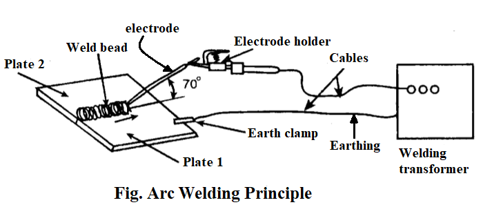
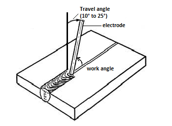
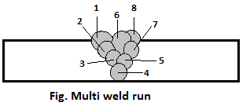
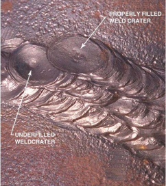
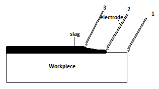

================================
Chapter 5: Arc welding technique
================================

Introduction
============

Arc welding is a welding process where coalescence is produced by heating with an electric arc, with or without applying pressure and also with or without applying filler metal depending upon base metal thickness. Shielded Metal Arc Welding (SMAW) is known as one of the oldest, simplest and versatile among other welding techniques and is widely (i.e. approximately 50%) used in industrial application and maintenance welding.

|

|

Procedures of arc welding are as follows:

|    1) The surface of workpiece to weld should be cleaned and the edges of the plates may be filed for perfect joint and greater strength.

|    2) The earth clamp is clamped to the plate to be weld and the welding rod is held in the electrode holder as shown in given figure.

|    3) The electric arc melts the welding rod and joins two metal plates together. Ensure the gap of 3 mm between the workpiece and the welding rod.

|    4) After welding is done, remove the slag using chipping hammer.

|
|
|

Dividing of heat energy
=======================

We can calculate the heat generated from ``shielded metal arc welding`` and ``submerged arc welding methods``. To calculate the heat energy produced while welding, following steps can be followed ::
    
    Work done (W) = Voltage required (V) x Current required (I) x Welding time (T)
    
    Heat = Arc Voltage x Current x Time

|

If arc is travelled S distance at constant time applying V voltage and I current then heat produced well be ::

    ( V x I x 60 ) / S      

    (i.e. joules per mm length of joint)

|
|

.. code-block:: console

    For example: Calculate the heat generated from welding when a welder 
    applies arc voltage of 25 volts,current of 400 ampere and travel 
    speed of arc was 100 mm per minute.

    Here, we have given
    Voltage applied (V) = 25
    Current applied (I) = 400
    Travel speed of arc (S) = 100
    Heat generated (W) =?
    
    We know that,   W   =   (V x I x 60) / S
                        =   (25 x 400 x 60) / 100
                        =   6 Kilo Joules per mm

    Therefore, 6 KJ of heat is generated while welding for the given data.

|
|
|

Arc striking method in welding work
===================================

Arc striking is the foremost and most important work need to be done before welding. Arc striking can be done from two different methods:
    #. **Scratching method**
    #. **Tapping method**

|

Scratching method
-----------------

Before starting to weld, the following typical steps should be considered:

    * Wear the proper personal safety equipment like a welding helmet, welding gloves, protective clothing, and footwear.
    * Make proper ground connection to the workpiece.
    * Select proper type and size of electrode.
    * Properly secure the electrode in the holder.
    * Polarity of the machine should coincide with that of the electrode.
    * Inspect machine and adjust necessary current for the job.

After arranging all the required equipment nearer to welding table along with arc machine setup, arc striking can be started. Then, with angle of 70 to 80 degrees scratch the workpiece as you scratch a matchbox with a matchstick. Once connection between positive and negative poles establishes then sparking occurs. As soon as the sparking occur, lift the electrode up to 6 millimeters and after few seconds bring the electrode down to hold normal arc. In this way arc striking can be done before every welding.  

|

Tapping method
--------------

After going through pre-striking steps of above tapping method can be performed. Tapping method involves a tap in workpiece with electrode and draw back. At the instant the electrode touches surface of workpiece, current flows through the point of contact and as electrode is withdrawn then an electric arc is formed where end of the electrode as well as spot on the workpiece melts. It is the best method because it minimizes arc strikes. It also has high chance of sticking the electrode to the workpiece. Therefore, it needs practice

|
|
|

Arc length and its effect
=========================

As you know when electrode is touched with workpiece then sparking occurs. After that electrode is hold up and arc forms between electrode and workpiece. Arc length is the distance between tip of the electrode to the surface of workpiece while welding. The length of arc formed while welding can be divided into three types:
    #. **Long arc** 
    #. **Short arc**
    #. **Correct arc**

|

Long arc
--------

If the arc length is longer than the diameter of electrode’s core-wire then that arc is called long arc.

Effects of long arc:
    i. Fusion and penetration will be low
    ii. No concentration of heat on one position 
    iii. High chances of overlap
    iv. Filler material falls in workpiece as droplets
    v. Welding bead contains porosity
    vi. More electrodes are needed etc.

|
|

Short arc
---------

If the arc length is shorter than the diameter of electrode’s core-wire then that arc is called short arc.

Effects of short arc:
    i. Fusion and penetration will be high.
    ii. Difficult for stabilizing arc.
    iii. Welding speed becomes slow.
    iv. Welding bead will have irregular heights.
    v. Electrode melts fast
    vi. Electrode and electrode holder get over-heated.

|
|

Correct arc
-----------

If the arc length is equal to the diameter of electrode’s core-wire then that arc is called short arc.

Effects of correct arc:
    i. Fusion and penetration will be right.
    ii. Welding joint will be strong.
    iii. It has very low spatter
    iv. Electrode is used less in number.
    v. Less slag enters in welded bead.
    vi. Electrode melts in same pace.

|
|
|

Travel speed of electrode rod
=============================

Speed of electrode rod should not be either too fast or too slow. If the speed of electrode rod is fast then melted metal cools and solidifies in faster pace which eventually leads to bead ripples. And if the speed of electrode rod is slow then bead of the weld gets high and wide. Following steps need to be considered for arc travel speed:

|    1) The speed must be lowered as the material thickness starts increasing.

|    2) Forehand welding technique is used for higher welding speeds.

|    3) According to the material thickness and joint, the welding current and arc speed is increased and vice-versa. 

|

.. note:: In forehand welding method, the torch is angled so that the electrode is fed in same direction as arc travel.

|
|
|

Angularity of electrode
=======================

The angle formed between workpiece and electrode is known as angularity of electrode. The angularity of electrode depends on the nature of workpiece joints and position. A small difference in angle does not affect the weld appearance or quality but large difference affects. Welding angle consists of two positions and they are work angle and travel angle. Work angle is the angle formed from the horizontal measured at right angles in the travel direction of welding. Travel angle is the angle formed in the direction of welding.

|
|
|

Multi weld run process
======================

Sometimes we have to weld according to the nature of workpiece. Welding is done after edge preparation on workpiece. Welding is done is various ways like single run (one bead), double run (two beads) and multi run (many beads). This technique helps to prevent workpiece from getting hard after overheat. Although multi-weld run process is applicable to all metals with different thickness but the factors like cost, risk of weld defects, need of pre-heating, residual stress and distortion increases as the thickness of metal increases.

|
|
|

Crater
======

Crater is formed when metal melts and forms a pool like structure after it came in contact with welding electrode. Depth and size of crater gives idea about the level of penetration. For a strong weld it is necessary for metal to melt and mix well with filler material. The weld bead crater must be cleaned before next welding because it could cause slag inclusion.

|
|
|

Methods of restarting new bead
==============================

A depression in the base metal is formed when you burn workpiece without any filler at the end of the weld bead. To restart a new bead, weld from the end of the crack and weld back into where the weld stopped. 

Initially, use chipping hammer and brush to clear slag formed   at the end of weld up to 12 mm. Then, start welding from opposite direction as shown in given figure i.e. from position 1 to position 3. This method gives beautiful appearance as well as strong weld.

What's Next
===========

`chapter6`_ 

.. _chapter6: chapter06.html

