=======================================
Chapter 6: Welding joints and positions
=======================================

Introduction to welding positions
=================================

There are mainly four types of welding positions which are given below”:
    #. **Flat position**
    #. **Horizontal position**
    #. **Vertical position**
    #. **Overhead position**

|

Flat position
-------------

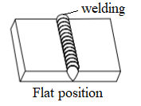

Here, welding is performed from the upper side of the joint and the face of the weld is approximately horizontal. This is the simplest and the most convenient position for welding which gives excellent welded joints in fast speed with minimum risk of fatigue.

|

Horizontal position
-------------------

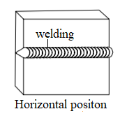

In HP, the plane of the workpiece is kept vertical and the weld is deposited in horizontal surface. Metal deposition rate is next to that achieved in flat position. It is commonly used welding in vessels and reservoirs. 

|
|
|

Vertical position
-----------------

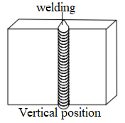

In VP, the plane of the workpiece is vertical and the weld is deposited upon a vertical surface. Due to force of gravity on the molten metal, it is difficult to produce satisfactory welds in this position. The welder must control the metal in constant pace to avoid the run and drop from the weld. Vertical welding can be of types viz., vertical-up and vertical-down. Vertical-up welding is preferred when strength is the main concern whereas vertical-down welding is used for sheet metal welding and for a sealing operation.

|

Overhead position
-----------------

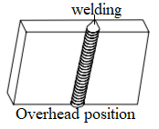

In OP, welding is even more difficult than vertical position because of greater gravitation pull against the molten metal. The force of the flame against the weld serves to counteract the pull of gravity. The plane of the workpiece is horizontal whereas the welding is carried out from the underside. It is a best practice to use very short arc and basic coated electrodes for overhead welding.

|
|
|

Introduction on welding joints
==============================

Welding is the manner in which materials fit together. To obtain sound welds, it is desirable that weld should completely penetrate the metal thickness. The heat will not be able to melt the joint edges to their entire thickness. So, edges of joining surfaces of metals are prepared first before welding. Different edge preparations may be used for welding butt joints, are given below: 

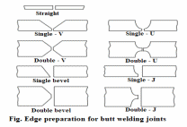

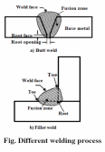

|
|
|

Different types of welding joints
=================================

1. Lap joint
------------

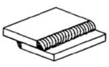
    
Lap joints are formed by overlapping one part over another and then welded. This type of joint is done to join two pieces with different thickness.
    a) Fillet weld
    b) J groove weld
    c) Bevel groove weld
    d) Flare bevel groove weld
    e) V groove weld
    f) Plug weld
    g) Spot weld

|

2. Butt joint
-------------

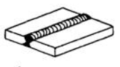

Butt joints are formed by placing the ends of two parts together. 

Different types of butt welding are:

    a) Square butt weld
    b) J groove weld
    c) Bevel groove weld
    d) U groove weld
    e) V groove weld
    f) Flare V groove weld
    g) Flare bevel groove weld

|

3. Edge joint
-------------

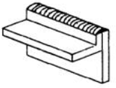

It is the joint formed by welding the edges of two parts together where the edges of two sheets are adjacent and parallel at the point of welding. 

Different types of edge joint are:
    a) Square groove weld
    b) J groove weld
    c) Bevel groove weld
    d) U groove weld
    e) Edge flange weld
    f) Corner flange weld

|

4. Corner joint
---------------

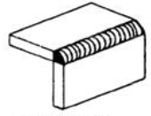

In corner joint, the corner of two parts are placed at right angle and joined to form a shape of L. 

Different types of corner joint are:
    a) Fillet weld
    b) J groove weld
    c) Bevel-groove weld
    d) U groove weld
    e) V groove weld
    f) Flare V groove weld
    g) Spot weld
    h) Corner flange weld
    i) Square groove weld
    j) Edge weld

|

5. T joint
----------

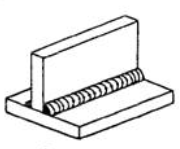

In a Tee-joint, one joint is the right angle to the other joint in the approximate shape of the letter “T”. These joints are a type of fillet weld and can be implemented while welding pipe or tube onto a base plate.

Different types of T-joints are: 
    a) Fillet weld
    b) J-groove weld
    c) Bevel-groove weld
    d) Plug weld
    e) Slot weld
    f) Melt-through weld
    g) Flare-bevel groove weld

|
|
|

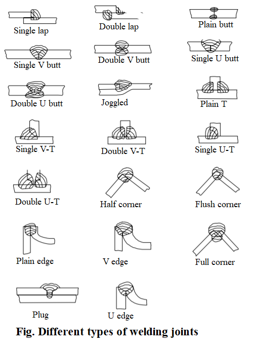

|
|
|

What's Next
===========

`chapter7`_ 

.. _chapter7: chapter07.html

