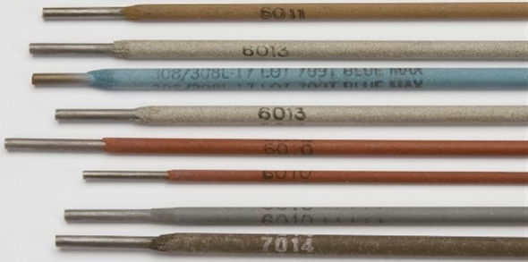

=====================
Chapter 7: Electrodes
=====================

Introduction
============

Electrode or the welding rod is a piece of wire connected to the welding machine through which current is fed to join two metals together. It is available without flux coating and with flux coating. One end of electrode is left without coating for electrode holder to hold. It is used to overcome the defects of metal and make stronger joints.

|
|
|

Types of welding electrode
==========================

There are two types of welding electrodes depending upon the process of welding and they are:
    #. **Consumable electrodes**
    #. **Non-consumable electrodes**

|
|

Consumable Electrodes
---------------------

Consumable electrodes have low melting point, therefore, are used in metal inert gas (MIG) welding. It is made from materials like mild steel and nickel steel. It is easy to use and maintain but need precaution while replacing electrodes in electrode holder. It can be categorized as bare electrodes and coated electrodes.

Bare electrodes do not have any coating in it and are employed where coated electrodes are not required thus makes welding cheaper.

Coated electrodes have coating in them. It is further divided into three sub-categories according to coating factor and they are:
    i. ``Light coated electrodes``
    ii. ``Medium coated electrodes``
    iii. ``Shield arc or Heavily coated electrodes``

**Light coated electrode** has coating factor of 1.25. It is applied to electrodes for enhancing arc stability as well as removing impurities like oxides and phosphorous. It produces thin slag and provides smoother and neater welds.

**Medium coated electrode** has coating factor of 1.45. 

**Heavily coated electrode** has coating factor ranging from 1.6 to 2.2. It has proper and well-defined composition. It is employed in heavy duty jobs like welding cast iron. 

    .. note:: There are three different types of heavy coated electrodes and they are:
        
        * Electrodes with cellulose coating
        * Electrodes with mineral coating
        * Electrodes with both cellulose and mineral coating.

|
|

Non-Consumable Electrodes
-------------------------

Non-consumable electrodes are not consumed or does not melt during welding. A little reduction in the length of electrode does occur due to the vaporization and oxidation process while welding. These electrodes have high melting point and are unable to fill the gap in the workpiece. Non-consumable electrodes are made from materials like pure tungsten, graphite or carbon coated with copper. These electrodes are made as cathode and the workpieces as anode. Shielding gases should be used while welding to protect welding area from oxygen and surrounding atmosphere.

On the basis of materials used, non-consumable electrodes are of two types:
    
    i. ``Carbon or Graphite electrode``
    ii. ``Tungsten electrode``

Carbon electrodes are used in arc welding and cutting. It can be without coating or with coating of copper. Its melting point is 3350 degree Celsius.

Tungsten electrode are used in TIG welding. It can be made with either pure tungsten, tungsten with 1% thorium, tungsten with 2% thorium or tungsten with 0.3-0.5% zirconium content. Pure tungsten is used for lighter welding applications. Its melting point is 3422 degree Celsius. 

|
|
|

Methods of using electrode
==========================

Welding of good welds comes from experience and with time. Electrode could get damage if you stick it for long time in one position of workpiece. 

The methods of using electrode are as follows:

|    1) You must keep the electrodes dry.

|    2) Do not bend the electrodes because it harms the electrode coating.

|    3) Electrode has 20 to 25 millimeters of uncoated region on one end. Electrode should be hold by electrode holder in that region only.

|    4) You should stop the welding when electrode’s length shortens below 40 millimeters.

|    5) Selection of election is necessary according to the nature of welding.

|    6) All the small pieces of used electrodes should be collected in on box.

|
|
|

Specification of electrode
==========================

Electrodes with varied sizes are required according to the thickness of our workpiece. Similarly, information like length of electrode and the electric current requirement of electrode are also necessary. Given below is the data for electrode based on British system.

.. csv-table:: .
    :widths: 25, 12, 12, 12, 12, 12, 12

    "**Electrode Sizes (S.W.G)**", "``14``", "12", "``10``", "8", "``6``", "4"
    "**Thickness (inch)**", "``1/16”``", "3/32”", "``1/18”``", "5/32”", "``3/16”``", "1/4”"
    "**Length (inch)**", "``12”``", "14”", "``18”``", "18”", "``18”``", "18”"
    "**Current (Ampere)**", "``30-60``", "50-70", "``100-120``", "180-200", "``180-200``", "250-300"
    "**Workpiece thickness**", "``up to 3 mm``", "up to 3 mm", "``up to 6 mm``", "up to 12mm", "``up to 12mm``", "up to 12mm"

|
|
|

Functions of electrode coating
==============================

Electrode coating performs many functions depending upon coating constituents, during welding to improve weld metal properties. The important functions are as follows:
    

|    1) Improves the electric conductivity in the arc region which improve the arc ignition and stabilization of the arc.

|    2) Formation of slag, which;
     
    |   a) Influences size of droplet.
    
    |   b) Protects the droplet during transfer and molten weld pool from atmospheric gases.
    
    |   c) Protects solidified hot metal from atmospheric gases.
    
    |   d) Reduces the cooling rate of weld seam.

|    3) Formation of shielding gas to protect molten metal.

|    4) Improve deposition rate with addition of iron powder in coating.

|    5) Provide deoxidizers like Si and Mn in form of FeSi and FeMn.

|    6) Alloying with certain elements such as Cr, Ni, Mo to improve weld metal properties.

|
|
|

Selection of electrode
======================

You must consider some factors before selecting welding electrodes and they are:

|    1) The electrode rod should have greater tensile strength compared to parent metals.

|    2) The specification of base metals. Since, electrode should have less thickness than of base metal.

|    3) The joint type and welding position.

|    4) Power source of welding i.e. AC or DC.

|    5) Quality of welding.

|    6) Skill and knowledge of welder.

|    7) Cutting of electrode.

|
|
|

Handling and storage of electrode
=================================

Electrode gets affected by moisture easily and should be kept in containers that gives moisture free environment. Some of the information on handling as well as storing electrodes are given below:

|    1) To keep the electrodes in right condition, place them with silica gel in drying cabinet.

|    2) Grab the group of electrodes in hand and rub together to find the dryness of electrodes. If sharp metallic sound is heard then they are dry else they are not.

|    3) If the electrodes are wet then they produce porosity, crack and violet arc.

|    4) If electrodes are wet then they should be heated in oven for around 2 hours at the temperature of 230 to 260 degrees Celsius.

|    5) Electrodes should not be bended while storing because it damages the coating.

|    6) Electrode boxes should not be stacked and thrown from height.

|
|
|

Weaving
=======

A steady, uniform motion of the electrode produces a satisfactory bead. A slight weaving or oscillating motion keeps the metal in molten state a little longer and allows the gas to escape, bringing slag to the surface. Weaving results in wider bead with better penetration.

|
|
|

Walkability
===========

It is the ability of material to weld or fuse with similar materials without cracking.

The factors that affects the weldability of metal are as follows:

|    1) Melting point of metal

|    2) Thermal conductivity (Metals like Aluminum and Copper having high thermal conductivity are difficult to weld materials.)

|    3) Reactivity

|    4) The coefficient of thermal expansion of metals

|    5) Electrical resistance

|    6) Surface condition

What's Next
===========

`chapter8`_ 

.. _chapter8: chapter08.html

