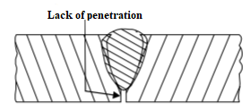
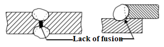
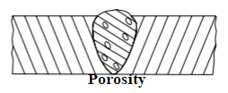
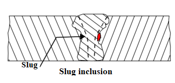
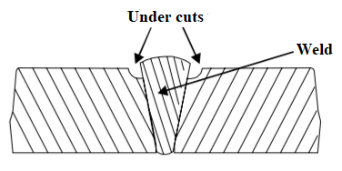
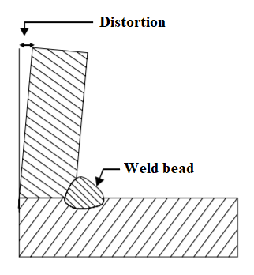
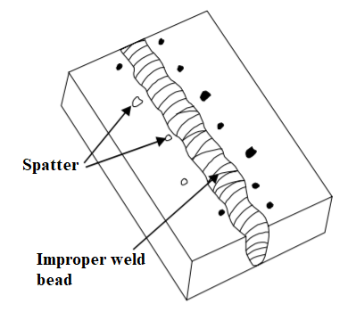
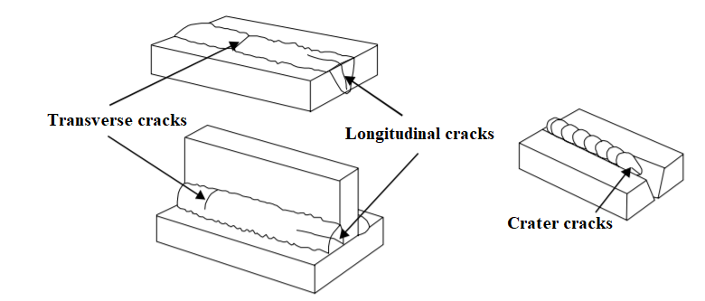

=========================================
Chapter 8: Welding defects and inspection
=========================================

Welding defects
===============

There are some welding defects and they are as follows:

a) Lack of penetration
----------------------

This type of defect occurs when the filler metal fails to penetrate into the joint. The reason for such failure can be:
    * Inadequate de-slagging
    * Incorrect edge penetration
    * Incorrect welding technique

|

b) Lack of fusion
-----------------

It is the situation when the filler metal fails to fuse with the parent metal and the reason can be:
    * Selection of incorrect welding technique
    * Insufficient heat
    * Too fast welding process

|

c) Porosity
-----------

This defect is caused by the trapping of gas during the welding process. Porosity means the small holes throughout the weld metal. The reasons for porosity are as:
    * Dampness
    * Fast cooling of the weld
    * Chemicals in the metal

|

d) Slag Inclusion
-----------------

It is the defect caused when the slag or other impurities are trapped in the weld. The reasons for such situation are:
    * If slag from previous runs are not cleaned
    * Poor cleaning and preparation of the base metal before welding.

|

e) Undercuts
------------

It is the groove or slot along the edges of the weld. This defect are caused by:
    * Too fast welding process
    * Inappropriate welding technique
    * Too great a heat build-up

|

f) Overlays
-----------

Overlays consists of metal on the parent metal without fusing with it. This defect is because of:
    * Contamination of the parent metal
    * Insufficient amount of heat

|

g) Blowholes
------------

Blowholes are the large holes in the weld and they are caused when:
    * Gas is trapped.
    * Filler of parent metals are contaminated

|

h) Distortion
-------------

Distortion is the situation where metal is distorted because of expansion and contraction of the heated portion of metal in welding. Some reasons for distortion are:
    * High cooling rate
    * Small diameter electrode
    * Poor clamping and
    * Slow arc travel speed

|

i) Poor weld bead appearance
----------------------------

It is formed when the width of the weld bead deposited is not uniform or straight. It can form because of following reasons:
    * Improper arc length
    * Inappropriate welding technique
    * Damaged electrode coating
    * Poor electrode
    * Earthing connection

|

j) Cracking
-----------

Cracks can be formed in both weld metal or in the parent metal. The reasons for cracking can be:
    * Unsuitable parent metals used for welding
    * Inappropriate welding technique

|

k) Burn through
---------------

It is the collapse of the weld pool and the reasons of burn through are:
    * High heat concentration
    * Poor edge preparation

|

l) Excessive penetration
------------------------

This defect means the weld metal extends above the surface or protrudes through the root of the weld. The reasons for excessive penetration are:
    i. Incorrect edge preparation
    ii. High heat concentration
    iii. Too slow welding process

|
|
|

Introduction of welding inspection
==================================

Welding is the most essential part of today’s industrial age. It is because of development in welding that today ships, rockets, aeroplanes, houses, machines, electronic devices and other are being made. Welding only is not enough if there is no quality. Therefore, inspection and test both are also equally important for increasing the reliability and durability in welded materials. Inspection of welding can be done in three phases and they are:

    #. **Inspection before welding**
    #. **Inspection during welding**
    #. **Inspection after welding (types in basic)**

|

Inspection before welding:
--------------------------

Before going to welding process, it is also necessary to analyze the structure of workpiece. If workpiece itself is of poor quality then welded product cannot be expected to be of good quality. Therefore, to bring quality, pleasant appearance and reliability in final product, following steps are need to be considered:
    i. Analysis of workpiece quality
    ii. Selection of welding method
    iii. Selection of skilled manpower
    iv. Weldability of filler material
    v. Required machine and equipment
    vi. Electrode according to workpiece
    vii. Welding joints and positions

|

Inspection during welding
-------------------------

Similarly, inspection during the welding can be done following given steps:
    i. Examining the arc length while welding
    ii. Inspecting whether welded metal is bonding well or not
    iii. Applying right amount of current
    iv. Making right angularity of electrode
    v. Constant speed while welding
    vi. Carefulness and alertness while welding
    vii. No entry for foreign matters.
    viii. Arc blow should not be there.

|

Inspection after welding (types in basic)
-----------------------------------------

Once welding is done, joints need to be inspected very carefully. Those joints with fine outward finish could have defects inside. So, test need to be performed by removing slag. To achieve strong, reliable and attractive welding, following test need to be performed:
    i. **Non-destructive test**
    ii. **Semi-destructive test**
    iii. **Destructive test**

Non-destructive test:
~~~~~~~~~~~~~~~~~~~~~

This type of test does not require cutting, splitting and breaking of workpiece. 

It is a simple mechanical test which can be performed by following methods:   
    a) Visual examination			
    b) Paraffin oil test			
    c) Stethoscope test			
    d) Ultrasonic test			
    e) Hydraulic pressure test		
    f) Magnetic particle test
    g) X-ray test
    h) Gamma ray test
    i) Dye penetrate test
    j) Air test

|

Semi-destructive test:
~~~~~~~~~~~~~~~~~~~~~~

A small part of welded metal is cut-off from the workpiece and installed as before after the test is done. This type of test is known as semi-destructive test. 

There are normally three methods for performing semi-destructive test and they are:
    a) Cutting test
    b) Acid etching test
    c) Drilling test

|

Destructive test:
~~~~~~~~~~~~~~~~~

Destructive test is used to get physical and mechanical properties of workpiece. Once this test is performed, the workpiece cannot be used again. Destructive test is done by twisting, breaking, cutting, stretching and hitting. 

There are some tests under destructive test and they are:
    a) Tensile test				
    b) Bend test					
    c) Impact test				
    d) Nick break test
    e) Hardness test
    f) Fillet Rupture test

|
|
|

Types of metal
==============

Metal are class of substance characterized by high electrical and thermal conductivity and other characteristics like malleability, ductility and high reflectivity of light. Steel, Aluminium, Lead, Tin, Brass, Bronze and Silver are all examples of metal. Metal can be divided into two types and they are:
    #. **Ferrous**
    #. **Non ferrous**

Ferrous Metal
-------------

Ferrous are those metal that are alloys of iron and other elements.

Some examples of ferrous metal are alloy steel, carbon steel, wrought iron and cast iron. 

Non-Ferrous Metal
-----------------

Non-Ferrous metals do not have iron in it.

Some examples of non-ferrous metal are copper, aluminium, silver and gold.

.. csv-table:: Difference between ferrous and non-ferrous metal
    :header: "S/n", "Ferrous metal",, "Non-ferrous metal"

    "1.","High concentration of iron is present.",,"Does not have any iron in them at all."
    "2.","Prone to rust when exposed to moisture.",,"It does not rust as ferrous when exposed to moisture."
    "3.","It is attracted by magnet.",,"It is not attracted by magnet."
    "4.","While hammering or beating it produces metallic sound.",,"It does not produce metallic sound."
    "5.","It has high melting point.",,"It has low melting point."
    "6.","It is used in heavy constructional works and tool manufacturing.",,"It is used in making pipes, roofing and small machine parts."

|
|
|

Physical properties of metal
============================

Metals have their distinct physical properties and they are:

1. ``Color of metal`` 
    (i.e. Color of aluminium is white.)

2. ``Specific weight``
    (i.e. Aluminium weighs 2.7gf/cm3)

3. ``Magnetic property`` 
    (i.e. Aluminium is not attracted to magnet)

4. ``Conductivity`` 
    (i.e.  Aluminium is a good conductor.)

5. ``Melting point`` 
    (i.e. Aluminum starts melting when temperature reaches 660 degree Celsius.) 

6. ``Molecular Structure`` 

|
|
|

Mechanical properties of metal
==============================

Mechanical properties of metal are as follows:

    #. Ductility
    #. Elasticity
    #. Hardness
    #. Malleability
    #. Brittleness
    #. Sonority (i.e. Sound produced upon hitting the metal.)

|
|
|

Method of metal identification
==============================

Some of the popular methods on metal identification are as follows:
    #. Visualization test (i.e. Color and surface appearance)
    #. Magnetic test 
    #. File test
    #. Oxy-Acetylene torch test for heat conductivity
    #. Spark test by observing sparks at grinding wheel under subdued light.
    #. Chip test by removing a small portion of material from metal with a sharp cold chisel.
    #. Hardness test and so on.

|
|
|

Effects of welding heat
=======================

| 1) While welding metal is heater over the range of temperature up to fusion and is allowed to cool. Such heating and cooling causes metallurgical and mechanical effects on workpiece around the heat affected zone.

| 2) Distortion and the residual stress are the result of mechanical effect after welding.

| 3) The residual stress reduces the load carrying capacity of the structure formed by the help of welding. Preheating the whole structure is necessary to reduce the residual stress.

| 4) Gas pockets and porosity can be formed in the final weld when dissolved gases becomes free from the metal. The welded metal in molten state can dissolve in ore gases like oxygen and nitrogen. As the metal cools and losses its dissolving capacity and dissolved gases becomes free from the metal creating the gas pockets.

|
|
|

What's Next
===========

`chapter9`_ 

.. _chapter9: chapter09.html

